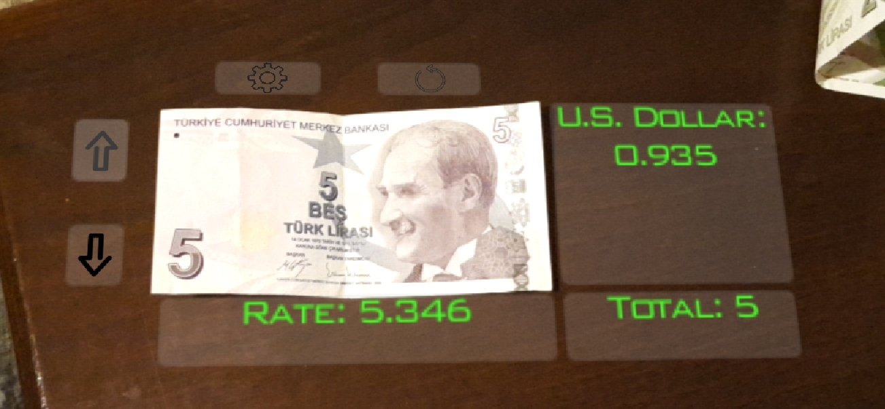

# Currency-Converter-Augmented-Reality
A mobile app made with Unity-Vuforia for dynamically displaying the converted value of the captured banknote into a target currency (140 countries)

* The app uses the image detection feature of Vuforia, and parses an XML document taken from the web site www.floatrates.com according to the information taken from the current image target captured by the camera. Then, using the parsed information it converts the current value of the banknote according to the target currency and displays the necessary information around the banknote. 

* Right now, USD and TRY banknotes are supported. However, it is really easy to make it supportable for any other country by just expanding the "target database" by using an image of the target banknote and its country code (ISO).

## How to

* Just open the app and the camera will be automatically activated. 
* Then, only thing you need to do is to direct the camera to the target banknote. 
* The application will convert it according to the currency rate. 
* You are able to choose between 140 different countries and see the value of your banknote in different currencies. 
* Additionally, you are able to add the banknotes one by one so that you are also able to convert a total value to a target currency. 
* Use the reset button to set total value to 0. 
* Use the settings button to see the inversed rate description between the currency of the banknote and the target currency.

## Galery
    
